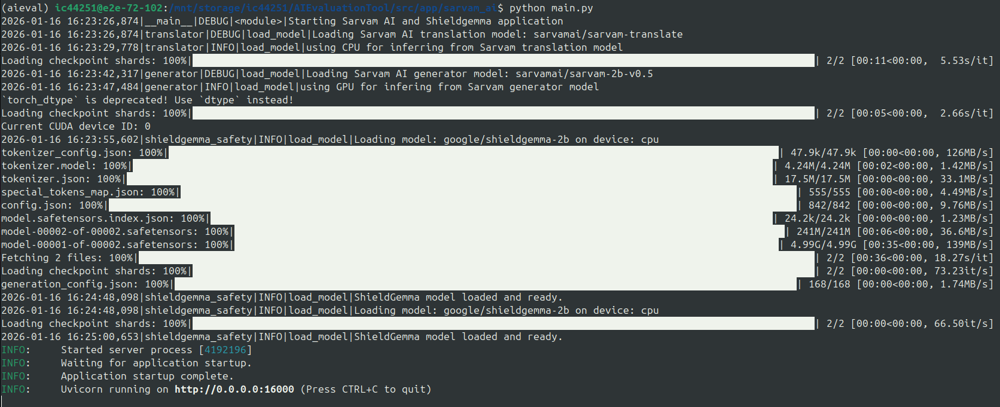
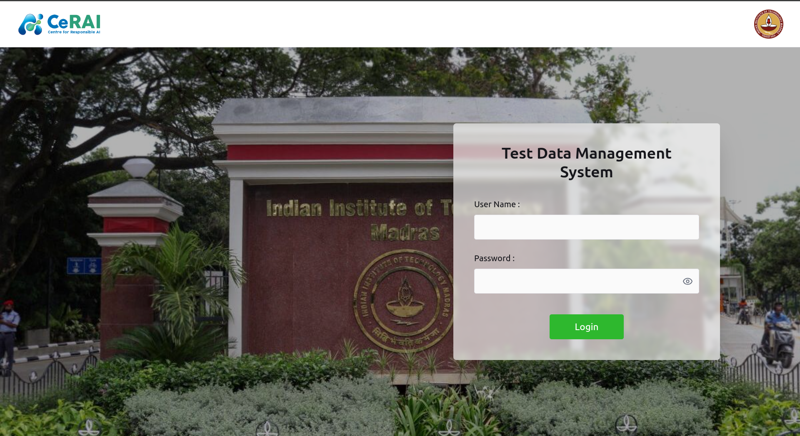

# AI Evaluation Tool

## 1. **Overview & Purpose**

### What is AIEvaluationTool?

AIEvaluationTool is a comprehensive, end-to-end framework designed to automate the evaluation of conversational AI systems across diverse real-world scenarios and quality metrics. It provides organizations with a robust mechanism to verify, test, and benchmark conversational agents—whether deployed as APIs, WhatsApp bots, or web applications—ensuring they meet high standards of accuracy, safety, and user experience.

### Target Audience

- **AI/ML Engineers** developing and deploying conversational AI systems
- **QA Teams** responsible for testing chatbots and virtual assistants
- **Product Managers** evaluating AI model performance before production deployment
- **Compliance Officers** ensuring responsible AI practices and ethical compliance

### Key Use Cases

- Automated testing of conversational agents across multiple platforms
- Performance benchmarking against predefined quality metrics
- Safety and toxicity evaluation of AI-generated responses
- Multi-language capability assessment
- Compliance verification for responsible AI standards

### Core Benefits

- **Automated Testing**: Eliminates manual testing through automated test case execution across WhatsApp, Web, and API interfaces
- **Comprehensive Evaluation**: Assesses 7 key dimensions including responsible AI, conversational quality, guardrails, language support, task understanding, performance, and privacy
- **End-to-End Pipeline**: Seamlessly integrates test execution, response analysis, and metric aggregation
- **LLM-as-Judge**: Leverages advanced language models for nuanced evaluation beyond rule-based metrics
- **Multi-Platform Support**: Evaluates agents across API, WhatsApp, and web application interfaces
- **Detailed Insights**: Generates comprehensive evaluation reports highlighting strengths and improvement areas

### Test Plans 

- **Responsible AI**: Evaluates ethical behavior by measuring fairness, bias, truthfulness, robustness, transparency, and cultural sensitivity in model responses.  
- **Conversational Quality**: Assesses coherence, fluency, relevance, and linguistic richness of responses using structural, semantic, and reference-based metrics.  
- **Guardrails and Safety**: Tests the model’s ability to detect, reject, and safely handle toxic, harmful, out-of-scope, hallucinated, and adversarial inputs.  
- **Language Support**: Measures multilingual capability with emphasis on Indian languages, including fluency, coverage, transliteration handling, and mixed-language contexts.  
- **Task Performance Metrics**: Quantifies task completion accuracy and correctness while accounting for valid rejections and failures.  
- **Performance and Scalability**: Evaluates system efficiency and reliability under load through latency, throughput, uptime, error rates, and failure resilience.  
- **Privacy and Safety**: Assesses resistance to misuse, jailbreaks, exaggerated safety behavior, and privacy leakage while ensuring appropriate privacy awareness.

### Supported Target Types
- **API**: RESTful or custom API endpoints
- **WhatsApp**: WhatsApp Business API integration
- **Web Application**: Web-based interfaces

## 2. **Architecture & Design**

### System Architecture

AIEvaluationTool follows a modular, layered architecture designed for scalability and extensibility:


### Core Components

**Data**
- Centralized MariaDB or SQLite database for storing test cases, configurations, and evaluation results
- JSON-based data files for test plans, strategies, and metric mappings

**Execution**
- **Test Case Executor**: Distributes and executes test cases across target platforms
- **Interface Manager**: Automates interactions with WhatsApp, web applications, and API endpoints using Selenium and ChromeDriver

**Analysis**
- **Response Analyzer**: Applies evaluation strategies to collected responses
- **Strategy Engine**: Implements model-based and rule-based evaluation techniques
- **LLM-as-Judge**: Leverages language models for nuanced conversational quality assessment

**Integration**
- **Sarvam AI Service**: Hosts multiple specialized models for text classification, translation, and toxicity detection
- **External APIs**: Perspective API for toxicity scoring, cloud LLM providers (OpenAI, Anthropic)

**Management**
- **TDMS (Test Data Management System)**: Web-based UI for managing test data, users, and permissions
- **ORM**: Abstracts database operations and data models


### Technology Stack

| Layer | Technology |
|-------|-----------|
| **Backend** | Python 3.10+, FastAPI |
| **Database** | MariaDB or sqlite |
| **Frontend** | Node.js 20.19+ or 22.14+ |
| **Web Automation** | ChromeDriver, Chrome Browser |
| **ML/AI Models** | Ollama, Hugging Face Transformers, OpenAI API |
| **APIs** | RESTful services, OpenAI-compatible endpoints |

### Key Dependencies

- **selenium**: Browser automation for web and WhatsApp interfaces
- **pydantic**: Data validation and ORM modeling
- **fastapi**: API server framework
- **requests**: HTTP client for API interactions
- **transformers**: Hugging Face model integration
- **ollama**: Local LLM deployment

### Project Layout

The AIEvaluationTool project is organized into a modular structure that separates concerns between data, application logic, libraries, and configuration files.

```
AIEvaluationTool/
├── data/
│   ├── DataPoints.json                 # Sample test dataset with evaluation prompts
│   ├── plans.json                      # Test plan definitions
│   ├── strategy_map.json               # Mapping of strategies to metrics
│   ├── strategy_id.json                # Strategy identifiers
│   ├── metric_strategy_mapping.json    # Metric to strategy associations
│   ├── defaults.json                   # Default configuration values
│
├── src/
│   ├── app/
│   │   ├── importer/                   # Data import to database module
│   │   │   ├── main.py                 # Entry point for data import
│   │   │   └── config.json             # Database and file configurations
│   │   ├── interface_manager/          # Platform interaction automation
│   │   │   ├── main.py                 # FastAPI service for interface management
│   │   │   ├── credentials.json        # Secured account credentials
│   │   │   ├── xpaths.json             # Locations to identify and interact with web elements
│   │   ├── testcase_executor/          # Test execution orchestration
│   │   │   ├── main.py                 # Test case execution manager
│   │   │   ├── config.json             # Target and database configuration
│   │   ├── response_analyzer/          # Response analysis and evaluation
│   │   │   ├── analyze.py              # Main analysis script
│   │   │   ├── report.py               # Report generation
│   │   │   ├── config.json             # Analyzer configuration
│   │   ├── sarvam_ai/                  # Local LLM model deployment
│   │   │   ├── main.py                 # Model server entry point
│   │   └── TDMS/                       # Test Data Management System
│   │       ├── back-end/               # FastAPI backend service
│   │       │   ├── main.py             # TDMS API server
│   │       │   ├── database/           # Database layer
│   │       │       ├── config.json     # Database layer
│   │       └── front-end/              # React/Node.js frontend
│   └── lib/
│       ├── strategy/..                 # Evaluation strategy implementations
│       │   ├── .env                    # Strategy configuration paths
│       │   └── .env.example            # Environment template
│       ├── orm/                        # Object-Relational Mapping layer
│       ├── data/                       # Pydantic data models
│       ├── interface_manager/          # Interface client library
│       │   └── client.py               # REST client for interface manager
│       └── utils/                      # Utility functions
├── requirements.txt                    # Python package dependencies
├── .env.example                        # Environment variables template
└── README.md                           # Project overview and quick start
```
---

### Module Descriptions

**data/** - Contains all test data, configurations, and reference materials
- Test datasets in JSON format
- Strategy mappings and metric definitions
- Default values and example data

---

**src/app/** - Application modules implementing core functionality
- `importer/` - Handles data import from JSON files to database
- `interface_manager/` - Manages automation across different platform types
- `testcase_executor/` - Orchestrates test execution workflow
- `response_analyzer/` - Analyzes responses and applies evaluation strategies
- `sarvam_ai/` - Hosts multiple specialized AI models for evaluation
- `TDMS/` - Web-based system for test data management and user access control

---

**src/lib/** - Reusable libraries and shared components
- `strategy/` - Evaluation strategy implementations (model-based and rule-based)
- `orm/` - Database abstraction and entity models
- `data/` - Pydantic data validation classes
- `interface_manager/` - REST client for interface manager communication
- `utils/` - Common utilities across modules

---

## 3. **Installation & Setup**

### 3.1 **Prerequisites and System Requirements**

Before installing AIEvaluationTool, ensure your system meets the following requirements:

**Hardware Requirements:**
- Minimum 8GB RAM (24GB+ recommended for local LLM deployment)
- Multi-core processor (4+ cores)
- 50GB+ free disk space (for models and databases)
- GPU support recommended for faster model inference (NVIDIA CUDA compatible)

**Software Requirements:**
- **Python 3.10+**
- **Node.js 20.19+ or 22.12+**
- **MariaDB Server 10.5+**
- **Google Chrome Browser** (latest version)
- **ChromeDriver** (must match your Chrome version - critical dependency)
- **Ollama** (for local LLM deployment)
- **GPU drivers** (NVIDIA CUDA for accelerated processing)

---

### 3.2 **Step-by-Step Installation Instructions**

#### **Step 1: Clone the Repository**

```bash
git clone https://github.com/cerai-iitm/AIEvaluationTool
cd AIEvaluationTool
```
---

#### **Step 2: Set Up Virtual Environment & Install Dependencies**

To ensure dependency isolation and reproducibility, create and use a Python virtual environment.

```bash
# Create virtual environment
python3 -m venv venv
```

Activate virtual environment
```bash
# Linux / macOS
source venv/bin/activate
```
```bash
# Windows
venv\Scripts\activate
```
Install all dependencies for each component using the provided `requirements.txt` files:
```bash
# Install required dependencies
pip install -r requirements.txt
```
---

#### **Step 3: Install ChromeDriver**

ChromeDriver is essential for web and WhatsApp interface automation. So first check the version of google chrome and then install the respective version of chromedriver version.

---

#### **Step 4: Set up Database**

##### **4.1 SQLite**
By defaults, sqlite database will be used for ease to store small amount of data.
For large testcase datasets, set up the MariaDB Database.

##### **4.2 Set Up MariaDB Database**

Create a new database and user:

```bash
# Login to MariaDB
mysql -u root -p

# Create database
CREATE DATABASE aievaluationtool;

# Create database user
CREATE USER 'aiet_user'@'localhost' IDENTIFIED BY 'secure_password';
GRANT ALL PRIVILEGES ON aievaluationtool.* TO 'aiet_user'@'localhost';
FLUSH PRIVILEGES;
EXIT;
```
---

#### **Step 5: Install Node.js Dependencies**

With the version 20.19+ or 22.12+.

---

#### **Step 6: Strategy .env**

Create `src/lib/strategy/.env` from `src/lib/strategy/.env.example`:

```bash
cp src/lib/strategy/.env.example src/lib/strategy/.env
```
---

#### **Step 7: Prepare Data Files**

Ensure the `data/` directory contains the following files (already present in the repository):
- `DataPoints.json` (sample test dataset)
- `plans.json`
- `strategy_map.json`
- `strategy_id.json`
- `metric_strategy_mapping.json`
- **A detailed set of Seeding data points shall be provided upon request.**

---

#### **Test Ollama Setup (Optional)**

If using local LLMs:

```bash
ollama pull qwen3:32b
ollama serve 
```

---

## 4. **Configuration**

#### **Step 1: Update Database Configuration**

Update `src/app/importer/config.json`, `src/app/testcase_executor/config.json` & `src/app/response_analyzer/config.json` with your database credentials, and target if you are using MariaDB, else no changes required for database:

```json
{
    "db": {
        "engine":"sqlite",
        "file": "AIEvaluationData.db",
        "host": "localhost",
        "port": 3306,
        "user": "root",
        "password": "jarvis2025",
        "database": "AIEvaluationData"
    },
    "target": {
        "application_type": "WHATSAPP_WEB",
        "application_name": "Vaidya AI",
        "application_url": "https://web.whatsapp.com/",
        "agent_name": "Vaidya AI"
    }
}
```
---

#### **Step 2: Configure Environment Variables**

To use the LLM-as-a-judge mechanism for evaluation, you must have a language model available. You can either:
- **Run a model locally** (e.g., using Ollama, OpenAI-compatible local models, etc.), or
- **Provide API keys** for cloud-based models (e.g., OpenAI, Anthropic, etc.)

**Supported Models:**
- OpenAI GPT-3.5/4 (via API key)
- Anthropic Claude (via API key)
- Ollama (local)
- Any OpenAI-compatible local model

Ensure that `.env.example` in the root folder is initialized with appropriate values to create a `.env` file :

```bash
# Service Endpoints
OLLAMA_URL="http://localhost:11434"
GPU_URL="http://localhost:8000"

# Model Configuration
LLM_AS_JUDGE_MODEL="qwen3:32b"

# API Keys
PERSPECTIVE_API_KEY="your_perspective_api_key"
SARVAM_API_KEY="your_sarvam_api_key"
GEMINI_API_KEY="your_gemini_api_key"
OPENAI_API_KEY="your_openai_api_key"
```
- `OLLAMA_URL` points to the installed Ollama instance's endpoint address.  Typically it is `http://localhost:11434/`
- `LLM_AS_JUDGE_MODEL` points to the name of the LLM (loaded via Ollama) that we want to use as a judge.  Typically, it is `llama3.1:70b`.
- `PERSPECTIVE_API_KEY` should have the API KEY of Perspective service for toxicity detection.
- `GPU_URL` should point to the Sarvam AI RestAPI server (./src/app/sarvam_ai/) hosted elsewhere.  Typically, the URL is `http://localhost:8000`.
- For API-based models, set your API key in a `.env` file or as an environment variable (e.g., `OPENAI_API_KEY`, `ANTHROPIC_API_KEY`).
- For local models, ensure the model server is running and accessible at the expected endpoint (see your model provider's documentation).

Ensure your model is accessible and properly configured before running the evaluation pipeline. Refer to the relevant documentation for your chosen model provider for setup instructions.

---
#### **Step 3: Configure XPath and Credentials**

XPath locators are used by automation frameworks (e.g., Selenium) to identify and interact with web elements.

- Locate the element in the web application (e.g., username field, password field, login button, prompt textbox and response element's xpath).
    - Right-click on the element → Inspect → Copy XPath.
    - Prefer relative XPath over absolute to avoid breakage when the DOM structure changes.
- Update the configuration file (`xpaths.json`).


``` json
{
  "applications": {
    "app_name_here": {
      "LoginPage": {
        "email_input": "xpath_for_email_input",
        "password_input": "xpath_for_password_input",
        "login_button": "xpath_for_login_button"
      },
      "LogoutPage": {
        "profile": "xpath_for_profile_icon",
        "logout_button": "xpath_for_logout_button"
      },
      "ChatPage": {
        "contact_search": "xpath_for_contact_search",
        "prompt_input": "xpath_for_prompt_input",
        "agent_response": "xpath_for_agent_response",
        "message_in": "xpath_for_incoming_message",
        "message_out": "xpath_for_outgoing_message"
      },
      "OtherPages": {
        "custom_element_1": "xpath_for_custom_element",
        "custom_element_2": "xpath_for_custom_element"
      }
    }
  }
}
```

To keep credentials secure and maintainable, here is the template of the `src/app/interface_manager/credentials.json`

```json
{
  "applications":
  {
    "cpgrams": {
      "username": "user_cpgrams",
      "password": "pass_cpgrams"
    },
    "openweb-ui": {
      "username": "user_openweb_ui",
      "password": "pass_openweb_ui"
    }
  }
}
```
---
#### **Step 4: Import the Target into the Database**

**Supported Target Types:**
- **API**: RESTful or custom API endpoints
- **WhatsApp**: WhatsApp Business API integration
- **Web Application**: Web-based interfaces

Add the following code to the end of `src/app/importer/main.py` to import your target application into the database:

```python
tgt = Target(
    target_name="your_agent_name", # Unique identifier for your agent
    target_type="API" # or "WhatsApp" or "WebApp"
    target_url="https://your-api-endpoint.com",  # Endpoint URL for the target service
    target_description="Your agent description",
    target_domain="Healthcare",  # or "Local API Interface"
    target_languages=["english"] # List of supported languages
)

target_id = db.add_or_get_target(target=tgt)
```

Replace the placeholder values with your actual target configuration details. The script will register your target and return its unique ID for use in subsequent operations.

---
#### **Step 5: Configure Test Data (TDMS)**

Create `src/app/TDMS/back-end/database/config.json`:

```json
{
    "db": {
        "host": "localhost",
        "port": 3306,
        "user": "aiet_user",
        "password": "secure_password",
        "database": "aievaluationtool"
    }
}
```
---
## 5. **Getting Started**
To getting started with tool following steps are provided for basics, for more detailed [click here](screenshots/Workflow.md).
### **AI Evaluation Tool**
#### 5.1.1 **Import Test Data into Database**

Before running evaluations, you need to import test data points into the database.

**Run the Importer Script :**

```bash
python3 src/app/importer/main.py --config "src/app/importer/config.json"
```

After successful execution, you should see output similar to:


---

#### 5.1.2 **Start the InterfaceManager API Service**

The InterfaceManager handles communication with target platforms (API, WhatsApp, Web).

**Step 1: Navigate to InterfaceManager Directory and Start the Service**

```bash
cd src/app/interface_manager
python main.py
```

You should see output like:


---

#### 5.1.3 **Configure and Run Test Case Executor**

The Test Case Executor sends test prompts to your target application.

**Step 1: Update Executor Configuration**

As above, `src/app/testcase_executor/config.json` updated with your target details and database credentials.

**Step 2: View Available Options**

```bash
cd src/app/testcase_executor
python main.py --config "config.json" -h
```


**Step 3: Get Available Test Plans**

```bash
python main.py --config "config.json" --get-plans
```

Expected output:


**Step 4: Get Available Metrics**

```bash
python main.py --config "config.json" --get-metrics
```

Expected output:


**Step 5: Execute Test Cases**

```bash
python main.py --testplan-id <testplan-id> --testcase-id <testcase-id> --metric-id <metric-id> --max-testcases <max-testcases> --config "config.json" --execute
```

Replace placeholders with actual values from your test plan. The executor will run and display:


The test execution interface will appear similar to:


---

#### 5.1.4 **Deploy LLM Models**

For evaluation using **LLM-as-Judge**, the following models must be available:

**Required Models**
1. `sarvamai/sarvam-2b-v0.5`
2. `google/shieldgemma-2b`
3. `sarvamai/sarvam-translate`
4. `qwen3:32b` (Default LLM-as-Judge)

> **Note**
> - Ollama’s default port **11434 is fixed**.
> - All other service ports (e.g., Sarvam AI) are **configurable** and can be changed to any free port.

LLM models seving can be done in following two ways :

**A. Local Serving**

Use this setup when running all services on the same machine.

- **Start Sarvam AI Service**
    ```bash
    cd src/app/sarvam_ai
    python main.py --port <free-port-local>
    ```

- **Pull and serve LLM-as-Judge**
    ```bash
    ollama pull qwen3:32b
    ollama serve
    ```
> Note: `ollama` serve usually runs by default and may not require manual execution.

**B. Remote GPU Serving(Port Forwarding)**</br>
Use this setup when models are hosted on a remote GPU machine.

- **Start Services on Remote GPU Machine** </br>
    Run the following commands on remote GPU machine-
    ```bash
    cd src/app/sarvam_ai
    python main.py --port <free-port-gpu>
    ```
    ```bash
    ollama pull qwen3:32b
    ```
- **Forward Remote Ports to Local Machine** 
    ```bash
    ssh gpu_machine_cred@machineIP \
    -L localhost:11434:localhost:<free-port-local> \
    -L localhost:<free-port-gpu:localhost:<free-port-local>
    ```
After serving sarvam ai, it will looks similar to following:



There are other small sized models which gets downloaded while running this application. The models are - 

1. amedvedev/bert-tiny-cognitive-bias
2. LibrAI/longformer-harmful-ro
3. vectara/hallucination_evaluation_model
4. thenlper/gte-small
5. all-MiniLM-L6-v2
6. nicholasKluge/ToxiGuardrail
7. sentence-transformers/paraphrase-multilingual-mpnet-base-v2
8. google/flan-t5-large
9. holistic-ai/bias_classifier_albertv2
10. Human-CentricAI/LLM-Refusal-Classifier
11. cross-encoder/nli-deberta-base

#### 5.1.5 **Run Response Analysis**

After testcase execution completes and responses are collected, analyze them by getting run-name from Test runs table from DB OR from the testcase executor logs.

**Step 1: Start Response Analyzer**

```bash
cd src/app/response_analyzer
python analyze.py --config "path to config file" --run-name <run-name>
```

The analyzer will process responses and display:


---

#### 5.1.6 **Generate Evaluation Report**

View comprehensive evaluation results and metrics.

```bash
cd src/app/response_analyzer
python report.py --config "path to config file" --run-name <run-name>
```

Use the same `run-name` from the analysis step.

The report will display detailed evaluation metrics:


---

### **Set Up Test Data Management System (TDMS)**

Access the web-based UI for managing test data and users.

#### 5.2.1 **Backend Setup**

**Step 1: Configure Database**

Update `src/app/TDMS/back-end/database/config.json` with your MariaDB credentials else sqlite will works by defaults.

**Step 2: Navigate and Start Backend**

```bash
cd src/app/TDMS/back-end
python3 main.py
```

#### 5.2.2 **Frontend Setup**

**Step 1: Install Dependencies**

After open a new terminal and run following commands:
```bash
cd src/app/TDMS/front-end
npm i
```

**Step 2: Start Development Server**

```bash
npm run dev
```



#### **Access TDMS**

Use these login credentials:

| Role | Username | Password |
|------|----------|----------|
| Admin | `admin` | `admin123` |
| Manager | `manager` | `manager123` |
| Curator | `curator` | `curator123` |
| Viewer | `viewer` | `viewer123` |

**User Permissions:**
- `canManageUsers` - Admin only
- `canCreateTables` - Admin, Manager & Curator
- `canUpdateTables` - Admin, Manager & Curator
- `canDeleteTables` - Admin & Manager

This module provides comprehensive CRUD (Create, Read, Update, Delete) operations for test cases within the TDMS (Test Data Management System) application.
Users can manage test cases directly through the user interface after successful authentication and login.
Operations include creating new test cases, retrieving existing ones, modifying test case details, and removing obsolete test cases from the system.
