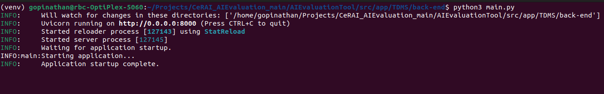
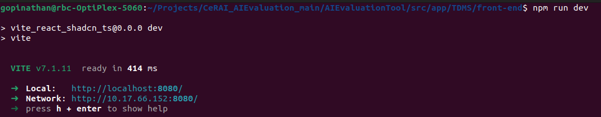
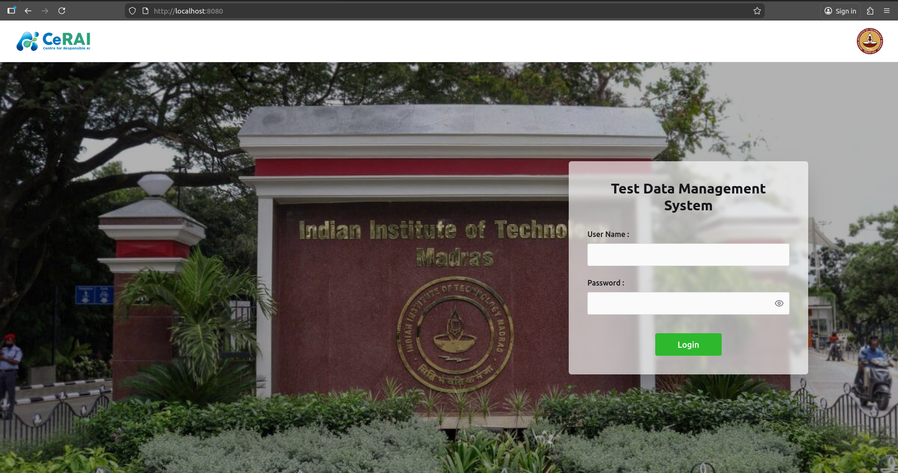
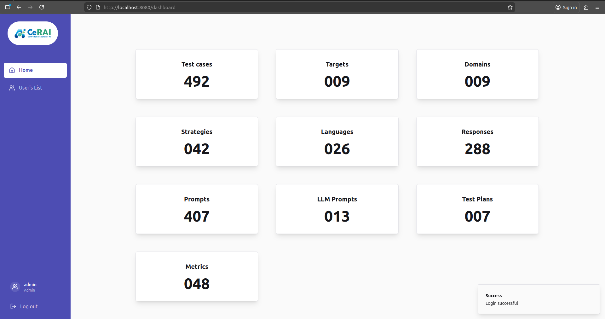

# TDMS - Test Data Management System


## Table of Contents

1. [Product Overview](#product-overview) 
2. [Installation Steps](#installation-steps)
3. [User Manual](#user-manual)

---

## Product Overview

### What is TDMS?

The **Test Data Management System (TDMS)** is a comprehensive web-based application designed to manage test data for AI evaluation workflows. It provides a centralized platform for creating, organizing, and managing test cases, prompts, responses, evaluation strategies, and related metadata required for testing conversational AI systems.

### Key Features

### System Architecture

TDMS follows a modern three-tier architecture:

```
┌─────────────────┐
│   Frontend      │  React + TypeScript + Vite
│   (React App)   │  Tailwind CSS + shadcn/ui
└────────┬────────┘
         │ HTTP/REST API
┌────────▼────────┐
│   Backend       │  FastAPI (Python)
│   (REST API)    │  SQLAlchemy ORM
└────────┬────────┘
         │
┌────────▼────────┐
│   Database      │  SQLite / MariaDB
│   (Data Store)  │
└─────────────────┘
```

### Technology Stack

**Frontend:**
- React 18.3+
- TypeScript
- Vite
- Tailwind CSS
- shadcn/ui components
- React Router
- TanStack Query

**Backend:**
- Python 3.10+
- FastAPI
- SQLAlchemy
- Pydantic
- JWT Authentication
- Uvicorn

**Database:**
- SQLite (default, for development)
- MariaDB (production option)

---

## Installation Steps

#### Step 1: Backend Setup

1. **Navigate to the backend directory:**
   ```bash
   cd src/app/TDMS/back-end
   ```

2. **Create a virtual environment (recommended):**
   ```bash
   python3 -m venv venv
   source venv/bin/activate  
   ```

3. **Install Python dependencies:**
   ```bash
   pip install -r requirements.txt
   ```

4. **Configure the database:**
   
   Edit `database/config.json`:
   
   **For SQLite (default, recommended for development):**
   ```json
   {
     "db": {
       "engine_type": "sqlite",
       "file": "TDMS.db"
     }
   }
   ```
   
   **For MariaDB (production):**
   ```json
   {
     "db": {
       "engine_type": "mariadb",
       "host": "localhost",
       "port": 3306,
       "user": "your_username",
       "password": "your_password",
       "database": "tdms_db"
     }
   }
   ```
   
   > **Note**: For MariaDB, ensure the database exists and the user has appropriate privileges.

#### Step 2: Frontend Setup

1. **Navigate to the frontend directory:**
   ```bash
   cd src/app/TDMS/front-end
   ```

2. **Install Node.js dependencies:**
   ```bash
   npm install
   ```

#### Step 3: Initialize the Database

The database will be automatically initialized when you start the backend server for the first time. Default users will be seeded automatically.

#### Step 4: Start the Application

**Terminal 1 - Start Backend Server:**
```bash
cd src/app/TDMS/back-end
source venv/bin/activate
python main.py
```

The backend will start on `http://localhost:8000`



**Terminal 2 - Start Frontend Development Server:**
```bash
cd src/app/TDMS/front-end
npm run dev
```

The frontend will start on `http://localhost:8080` (or another port if 8080 is busy)



#### Step 5: Access the Application

1. Open your web browser
2. Navigate to `http://localhost:8080` (or the port shown in the terminal)
3. You should see the login page



### Default Login Credentials

The system comes with four default user accounts for testing:

| Role     | Username | Password   |
|----------|----------|------------|
| Admin    | admin    | admin123   |
| Manager  | manager  | manager123 |
| Curator  | curator  | curator123 |
| Viewer   | viewer   | viewer123  |

---

## User Manual

### Getting Started

#### Logging In

1. Open the TDMS application in your web browser
2. Enter your username and password
3. Click "Login" or press Enter
4. Upon successful login, you'll be redirected to the Dashboard



#### Understanding the Interface

The TDMS interface consists of:

- **Sidebar**: Navigation menu on the left with links to different sections, shows user information and logout option
- **Test Cases**: Manage test cases
- **Test Plans**: Manage test plans
- **Targets**: Manage target systems
- **Prompts**: Manage prompts
- **Responses**: Manage responses
- **Strategies**: Manage evaluation strategies
- **LLM Prompts**: Manage LLM judge prompts
- **Domains**: Manage domains
- **Languages**: Manage languages
- **Metrics**: Manage evaluation metrics
- **Users** (Admin only): Manage user accounts

### Managing Test Cases

Test cases are the core entities in TDMS. Each test case contains:
- A prompt (user prompt and optional system prompt)
- An response (expected or actual response)
- An evaluation strategy
- Associated metrics
- Domain and language information
- An optional LLM judge prompt

#### Creating a Test Case

1. Navigate to **Test Cases** from the sidebar
2. Click the **"Add Test Case"** button
3. Fill in the form:
   - **Test Case Name**: A descriptive name for the test case
   - **User Prompt**: The input prompt for the AI system
   - **System Prompt** : System-level instructions
   - **Response Text** : Expected or actual response
   - **Response Language** : Language of the response
   - **Response Type** : Type of response (e.g., "GT" for Ground Truth)
   - **Strategy Name**: Select an evaluation strategy
   - **Metric Name**: Select one or more evaluation metrics
   - **Domain Name**: Select or enter a domain
   - **Language Name**: Select or enter a language
   - **LLM Judge Prompt** (based on strategy): Prompt for LLM-based evaluation
   - **Notes** : Additional notes about this test case
4. Click **"Submit"**

#### Viewing Test Cases

1. Navigate to **Test Cases**
2. You'll see a table listing all test cases with:
   - Test Case ID
   - Test Case Name
   - User Prompt
   - System Prompt
   - Response Text
   - Strategy Name
   - Domain Name
   - Language Name
   - Metric Names
3. Use the search/filter options to find specific test cases
4. Click on a row to view details (if available)

#### Updating a Test Case

1. Navigate to **Test Cases**
2. Find the test case you want to update
3. Click the **"Edit"** button for that test case
4. Modify the fields as needed
5. Add notes about the changes
6. Click **"Update"**

#### Deleting a Test Case

1. Navigate to **Test Cases**
2. Find the test case you want to delete
3. Click the **"Delete"** button 
4. Confirm the deletion

> **Note**: Only users with appropriate permissions (Admin, Manager) can delete test cases.

### Managing Test Plans

Test plans group test cases and metrics together for organized evaluation.

#### Creating a Test Plan

1. Navigate to **Test Plans**
2. Click **"Add Test Plan"**
3. Fill in:
   - **Test Plan Name**: A descriptive name
   - **Description** (optional): Additional details
   - **Test Cases**: Select test cases to include
   - **Metrics**: Select metrics to evaluate
4. Click **"Submit"**

#### Managing Test Plans

- View all test plans in the Test Plans page
- Edit test plans to add/remove test cases or metrics
- Delete test plans (Admin/Manager only)

### Managing Prompts

Prompts are reusable input texts that can be associated with test cases.

#### Creating a Prompt

1. Navigate to **Prompts**
2. Click **"Add Prompt"**
3. Fill in:
   - **User Prompt**: The user-facing prompt text
   - **System Prompt**: System-level instructions
   - **Domain**: Select or create a domain
   - **Language**: Select or create a language
4. Click **"Submit"**

#### Searching Prompts

Use the search functionality to find prompts by:
- User prompt text
- System prompt text
- Domain
- Language

### Managing Responses

Responses store the output from AI systems or expected outputs.

#### Creating a Response

1. Navigate to **Responses**
2. Click **"Add Response"**
3. Fill in:
   - **Response Text**: The response content
   - **Response Type**: Type of response (e.g., "GT", "Generated")
   - **Language**: Language of the response
4. Click **"Submit"**

### Managing Strategies

Strategies define how test cases should be evaluated.

#### Creating a Strategy

1. Navigate to **Strategies**
2. Click **"Add Strategy"**
3. Fill in:
   - **Strategy Name**: A unique name
   - **Description** (optional): Details about the strategy
4. Click **"Submit"**

### Managing Targets

Targets represent the systems or applications being tested.

#### Creating a Target

1. Navigate to **Targets**
2. Click **"Add Target"**
3. Fill in:
   - **Target Name**: Name of the target system
   - **Target Type**: Type of target (e.g., "WhatsApp", "WebApp")
   - **Description** (optional): Additional details
4. Click **"Submit"**

### Managing Domains

Domains categorize test data by subject area (e.g., "Healthcare", "Finance", "Education").

#### Creating a Domain

1. Navigate to **Domains**
2. Click **"Add Domain"**
3. Enter the domain name
4. Click **"Submit"**

### Managing Languages

Languages represent the language of prompts and responses.

#### Creating a Language

1. Navigate to **Languages**
2. Click **"Add Language"**
3. Enter the language name (e.g., "English", "Hindi", "Tamil")
4. Click **"Submit"**

### Managing Metrics

Metrics define what aspects of responses are being evaluated.

#### Creating a Metric

1. Navigate to **Metrics**
2. Click **"Add Metric"**
3. Fill in:
   - **Metric Name**: Name of the metric (e.g., "Toxicity", "Similarity", "Grammar")
   - **Description** (optional): Details about the metric
4. Click **"Submit"**

### Managing LLM Prompts

LLM Prompts are used for LLM-as-a-judge evaluation methods.

#### Creating an LLM Prompt

1. Navigate to **LLM Prompts**
2. Click **"Add LLM Prompt"**
3. Fill in:
   - **Prompt**: The evaluation prompt text
   - **Language**: Language of the prompt
4. Click **"Submit"**

### User Management (Admin Only)

Admins can manage user accounts.

#### Creating a User

1. Navigate to **Users**
2. Click **"Create User"**
3. Fill in:
   - **Username**: Unique username
   - **Password**: Secure password
   - **Role**: Select from Admin, Manager, Curator, or Viewer
4. Click **"Create"**

#### Updating a User

1. Navigate to **Users**
2. Find the user and click **"Edit"**
3. Modify username, password, or role
4. Click **"Update"**

#### Deleting a User

1. Navigate to **Users**
2. Find the user and click **"Delete"**
3. Confirm deletion

### Role-Based Permissions

Different user roles have different permissions:

#### Admin
- ✅ Full access to all features
- ✅ User management (create, update, delete users)
- ✅ All CRUD operations on all entities
- ✅ View activity history

#### Manager
- ✅ Create, update, delete tables/entities
- ❌ Cannot manage users
- ✅ View activity history

#### Curator
- ✅ Create and update records
- ❌ Cannot delete records
- ❌ Cannot manage users
- ✅ View activity history (limited)

#### Viewer
- ✅ View all data (read-only)
- ✅ Export data (if available)
- ❌ Cannot create, update, or delete
- ❌ Cannot manage users

---